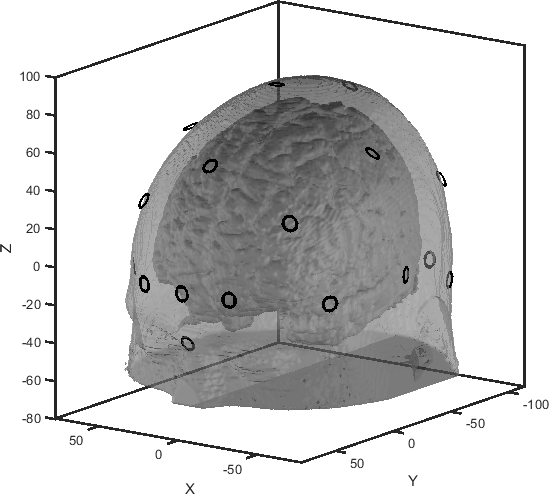

## Brain and Head templates

To make results compareable between different brain imaging studies reference spaces are necessary; the so called templates. 

Different kinds of templates have been developed and published:

| | | |
| --- | --- | --- |
| Colin27 | Combination of 27 MRI scans of the same subject, thus comprising high detail. | [Link](http://nist.mni.mcgill.ca/?p=935) |
| ICBM | Combination of MRI scans of 152 different subjects. The 3D print have have in our lab is based on this template. | [Link](http://www.bic.mni.mcgill.ca/ServicesAtlases/ICBM152NLin2009) |

To make a template usable for brain mapping in my rourines a mat-file `<template name>.mat` needs to be put in the `<routines-base-dir>\brainprobeset\templates\`-folder. You may load one of these mat-files to check out, which variables need to be store in the file:

  * `brain_patch` and `head_patch` //(MatLab-structure)//: Structures defining the brain and head surface. Patches are graphical objects that representet surfaces (see [more help](https://de.mathworks.com/help/matlab/ref/patch.html)).
  * Parcelation structure (e.g. `brodmann`): The field `xyz` yields the 3d coordinates (units milliteter) of each voxel of a parcelation. The field `area` yields the area ID for each voxel. The field `label` holds the label for each ID.

**Note that** all typicall templates have a quite big head size (> 60 cm). Thus, to fit different head size I scaled the Colin27 (62 cm) template to 54 cm, 57 cm and 61 cm (`Colin27(541mm).mat`, `Colin27(570mm).mat` and `Colin27(610mm).mat` in the template folder).

## Coordinate system

The following figure illustrates the coordinate system for the Colin27(570mm) template. The x-axis points from left to right, the y-axis points from rear to front and the z-axis points from bottom to top. The unit is millimeter

