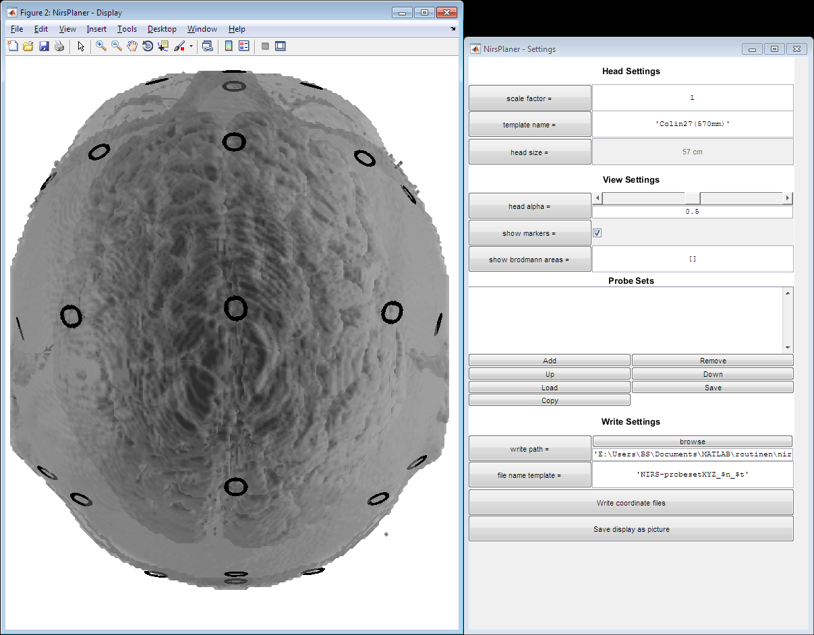
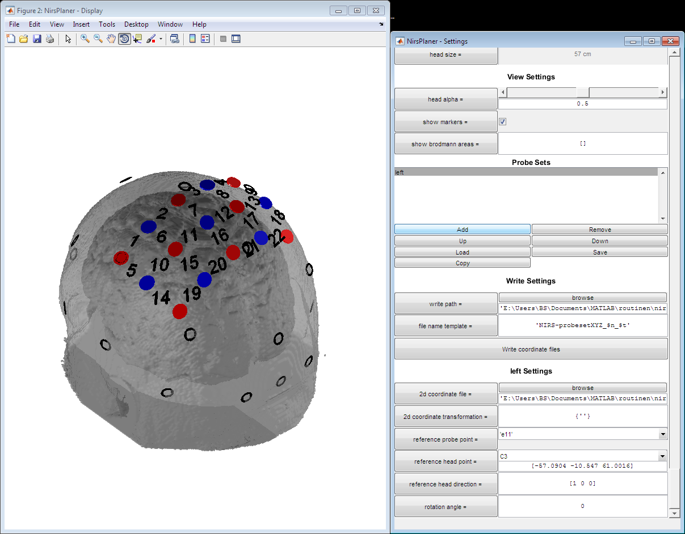
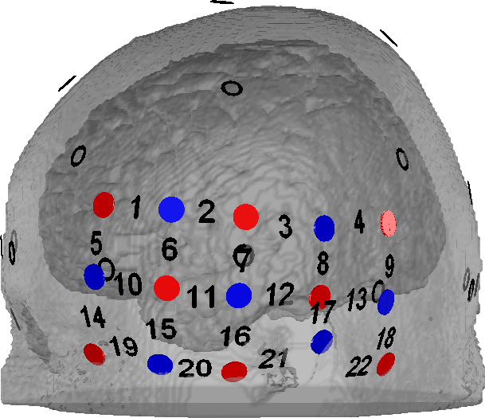
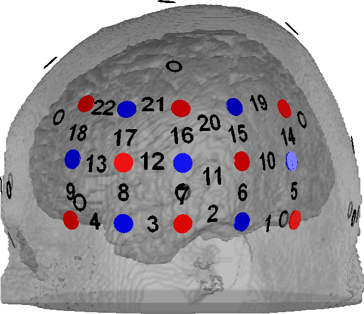
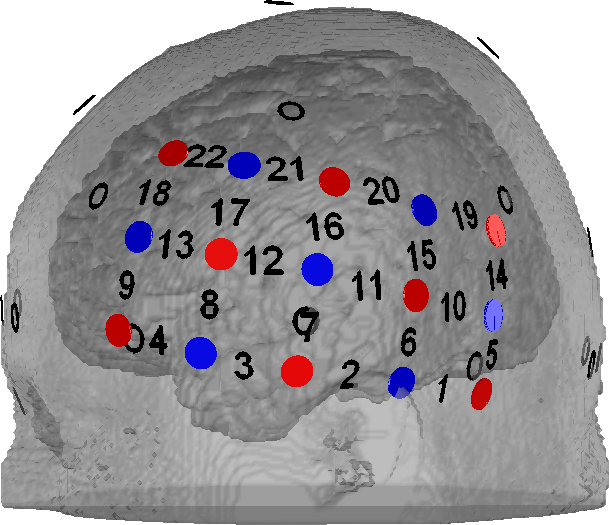
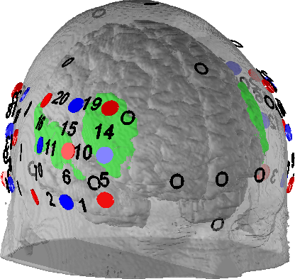
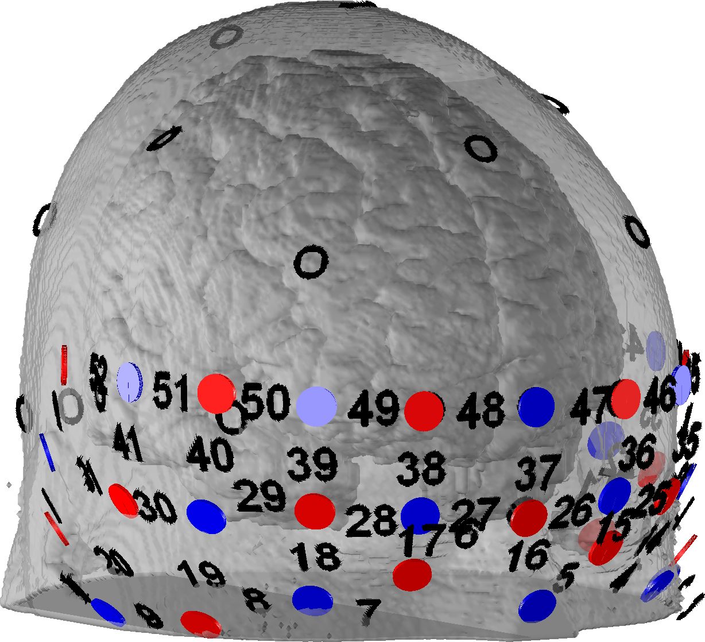
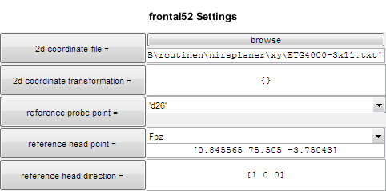
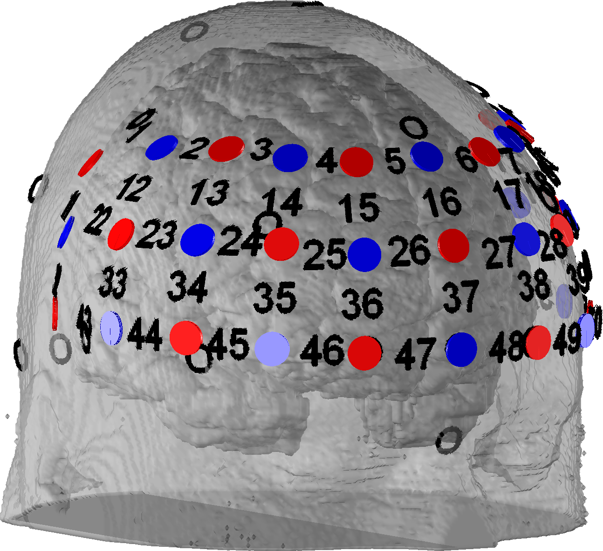
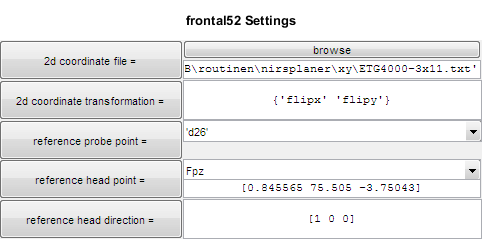

## Start 

Type into MatLab console:

    nirsplaner

A window like this should appear:

## Display 

### Settings

You have the following display options:

| Head Settings | |
|-------|--------|
| **scale factor** | Scale factor of the template. Use this number to scale the templae to a certain size. |
| **template name** | Name of the displayed template.  Available templates are stored in the `<routines-base-dir>\brainprobeset\templates\`-folder |
| head size _(read-only)_ | Displays the head size of the current head. Dependent on the scale factor and the template name. |

| View Settings | |
| --- | --- |
| **head alpha** | Transparency setting of the head. When 0, no head is shown. A value of 1 will lead to a non-transparent head. |
| **show markers** | Turn on or off 10/20-Markers |
| **show brodmann areas** | Give a vector of Brodmann-Area-IDs (For instance `[9 46]` for the dlPFC). These areas will be marked green in the display window. |

### Export

To export the current display as a picture, click "Save display as picture" in the "Write Settings"-section.

## Probe Sets 

### Add probe set

To put a probe set on the head a 2d-coordinate file is needed. There are pre-defined files in the `NirsPlaner\xy`-folder, including all usual ETG-4000 arrangements, but also NIRx and Artinis arrangements.

To add a probe set, click "Add" in the "Probe Sets"-section. Type a name (it can't be changed) - "left" in this example - and click "Ok". A new probe set will be created with default settings (2d coordinate file: ETG4000-3x5probe1.txt, emitter 11 on marker point C3). This probe set should appear on the head as well as a setting-section in the right panel:

### Arrange probe set

We now rearange the probe set to cover the left temporal lobe. Therefore, we set the `refernce head point` to 'T3' and the `refernce probe point` to 'CH07'. After that we adjust the `reference head direction` (see [here](./general.md) for the orientation of the coordinate system):

|  `reference head direction = [1 0 0]`  |  `reference head direction = [0 1 0]`  |  `reference head direction = [0 1 0.2]`  |
| --- | --- | --- |
|    |   |   |
|  Arrangement of the probe from left to right, leading - in this case - to a reversed probe.  |  Arrangement from rear to front, leading to a correct orientation.  |  Adding some z-direction.  |

Finally we add probe set to the right hemisphere. Therefore, we click "Add" in the "Probe Sets"-section. We type "right" and click "Ok". We change the 2d-coordinate file from `...\ETG4000-3x5probe1.txt` to `...\ETG4000-3x5probe2.txt`.  We set `refernce head point` to 'T3', `refernce probe point` to 'CH07' and `reference head direction` to [0 -1 0]:

(Also added `[22 44 45]` to the `show brodmann areas` line to see, whether we cover auditory and speech related regions.)

### 2d transformations

The probe set proberty `2d_transformations` is used to transform the coordinates from the 2d-coordinate file. The option are `flipx` and `flipy`. These transformations are applied to the 2d-coordinates before the 3d-coordinates are calculated based on the probe settings.

For instance, we add a 52-channel using the 2d-coordinate file `ETG4000-3x11.txt` and choose `reference_probe_point` as `d26` and `reference_head_point` as `Fpz`:

That looks wrong. We add the transformations to `{'flipx' 'flipy'}`:

Better.

### Save and Load

Use the "Save"-button to save the current probe set list as mat-file on a hard drive. This will be independent on the current template settings. Use the "Load"-button to load such a mat-file.

### Export as text-file

To export the probe set list as text-files use the "Write coordinate files"-button in the "Write Settings"-section. One file per probe set will be written including the XYZ-coordinates for each channel and the name of the current template (caution: the template and the scale factor has an influence on the the channel coordinates). Each file name will be created according to the `file name template`. Following replacements are available:

 * `$n`: Name of the probe set
 * `$t`: Name of the template

This kind of text file can be [readin-in](../userman/coords.md#3d-coordinates) by `NirsProbeset`-objects, using the `brain_coord_file`-property.

## Costum 2d-coordinate files

Open existing 2d-coordinate files in the `nirsplaner\xy`-folder to check out the structure. In this kind of file the probe names (using the keyword "PR") and the respective 2d-positions are defined. After that, you may also define measurement channels (using the keyword "CH") by naming the probes forming a channel. The channel position will be set to the mean coordinates of the probes. Channels may be generally formed by 1 to n probes.
