Init a routine package with version >= 2016-10-27. Download example {{:usersection:psychphys:manual:brainmapping_speechnoise.m |m-file}} and example {{:usersection:psychphys:manual:speechnoise.mat |data}}. You can find all code-snippets in this manual also in the example m-file `brainmapping_speechnoise.m`. Load example mat-file `speechnoise.mat` to your workspace.
``` matlab
% for example by:
load speechnoise.mat
```
The results-structure contains the beta-values of a model-based analyses. Temporal brain activation was provoced using a block-desgin paradigm with 20s speech-noise stimuli. From the whole group "block_all" subjects were selected - "block_biter" - who showed at least one [[:usersection:psychphys:artifacts:start#Temporal bite artifact|artifact]] caused by the constricrtion of the temporal muscle. The remaining subjects are in the group "block_nonbiter".
  
Now we calculate t-values for the beta-values stored in the `results`-structure:
``` matlab
T = NirsStatistics();
T = T.automaticTtesting(results ...
    ,{'oxy','deoxy'} ...
    ,{'p1','p2'} ...
    ,{'block_nonbiter','block_biter','block_all'} ...
);
```

## 2d

To map the result in form of t-values, we first create a NirsPlotTool `P` and attach the two NIRS probe sets `PS1` (left) and `PS2` (right):
``` matlab
P = NirsPlotTool();
P = P.setProperty('probesets',{'name','left' ,'probeset',PS1});
P = P.setProperty('probesets',{'name','right','probeset',PS2});
```
To map the t-values we check, which t-tests are available in the NirsStatistics object `T`:
```
  >> T.tags(1)
  ans = 
    'oxy.p1.block_nonbiter'
    'deoxy.p1.block_nonbiter'
    'oxy.p2.block_nonbiter'
    'deoxy.p2.block_nonbiter'
    'oxy.p1.block_biter'
    'deoxy.p1.block_biter'
    'oxy.p2.block_biter'
    'deoxy.p2.block_biter'
    'oxy.p1.block_all'
    'deoxy.p1.block_all'
    'oxy.p2.block_all'
    'deoxy.p2.block_all'
```
We want to see the t-maps for oxy- and deoxy-Hb and for the left and right (i.e. 'p1' and 'p2') hemisphere respectively for the group 'block_nonbiter' only. Thus, we need to set the 'tests2map'-, 'probesets2map'- and 'view_angles'-property of `P` as follows:
``` matlab
P = P.setProperty('tests2map',{ ...
    ;{'oxy.p1.block_nonbiter'}  ,{'oxy.p2.block_nonbiter'} ...
    ;{'deoxy.p1.block_nonbiter'},{'deoxy.p2.block_nonbiter'} ...
}); % 2x2 cell-array
P = P.setProperty('probesets2map',{ ...
    ;{'left'},{'right'} ...
    ;{'left'},{'right'} ...
}); % also 2x2 cell-array
```
You can see from the 'tests2map' input that oxy-Hb will cover the 1st row of the plot and deoxy-Hb the 2nd row. Furthermore, the left hemisphere will cover the left column and the right hemisphere the right column. Thus, we set some more properties:
``` matlab
P = P.setProperty( ...
    'row_names',{'oxy-Hb','deoxy-Hb'} ...
    ,'column_names',{'left','right'} ...
    ,'show_colorbar','t-values' ...
);
```         
Finially to create the map, we use the 'map'-method of `P` with the flag 'statistics' and pass the statistics object `T` as 2nd argument:
``` matlab
P.map('statistics',T);
```
The results should look like this:

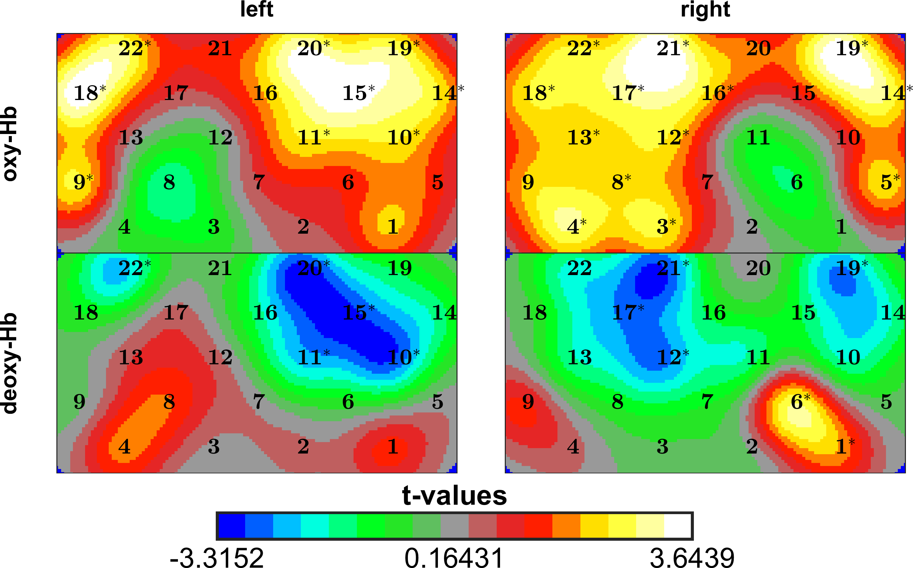
          
Now we are able to choose a smoother color limit, -3.5 to 3.5 should do the trick. Addional we see that all t-values above roughly 2.0 are indicated by an asterisk as significant. Obviously no correction for multiple comparison is applied. Let's check this
```
>> T.getProperty('correction_method')
  ans =
  none
```    
and change it
``` matlab
T = T.setProperty('correction_method','armitage-parmar'); % also possible 'bonferroni-holm' or 'bonferroni'
P.map('statistics',T);
```
resulting in

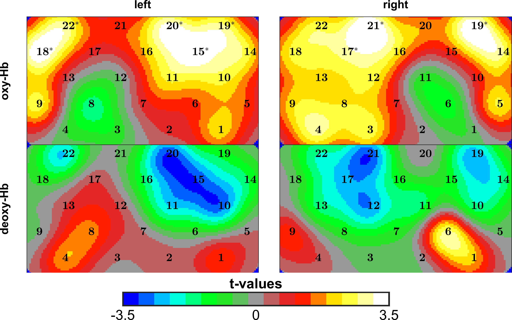


## 3d

Let's perceed to 3d mapping. Therefore we set the 'map_type'-property. Furthermore we specify the 'view_angles'-property to have a good spectation angle for each hemisphere.
``` matlab
P = P.setProperty('view_angles',{ ...
    ;[-90 10],[90 10] ...
    ;[-90 10] [90 10] ...
}); 
P = P.setProperty('map_type','brain_map');
P.map('statistics',T);
```

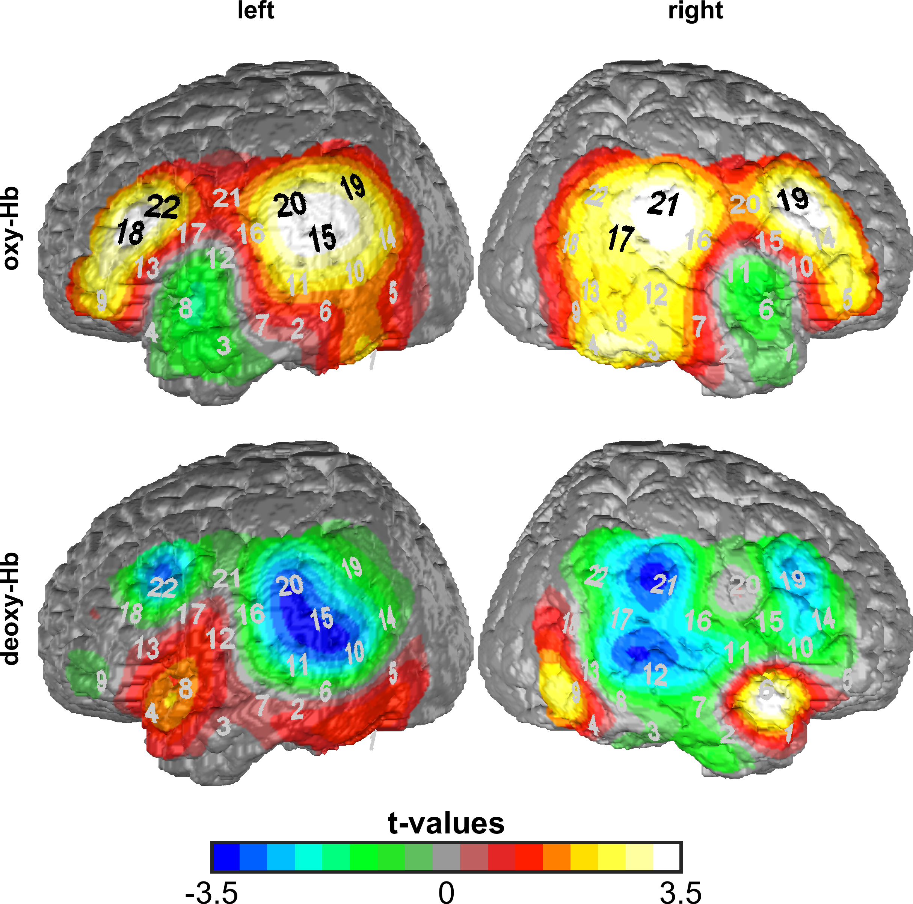


## Color maps ##

To mask lower t-values, we can use the color map 'gap' and the 'color_gap'-property. Note that the 'color_gap'-property only has an effect when using the 'gap' color map:
``` matlab
P = P.setProperty('color_map','gap','color_gap',[-2 2]);
P.map('statistics',T);
```

| `color_gap` | | |
|-------|--------|---------|
| `[-2 2]` | `[-1 1]` | `[]` |
| 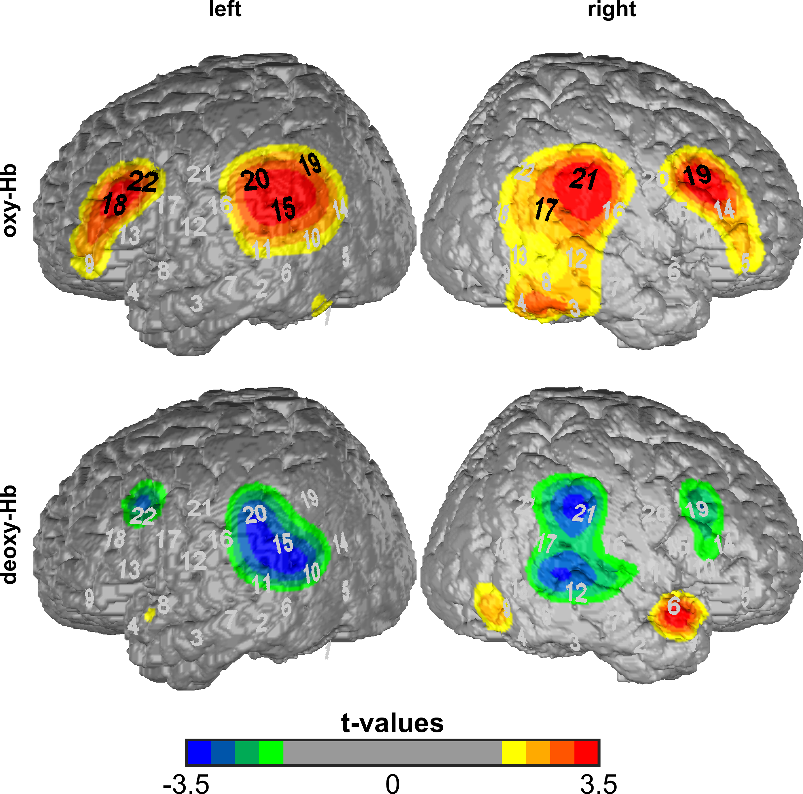 | 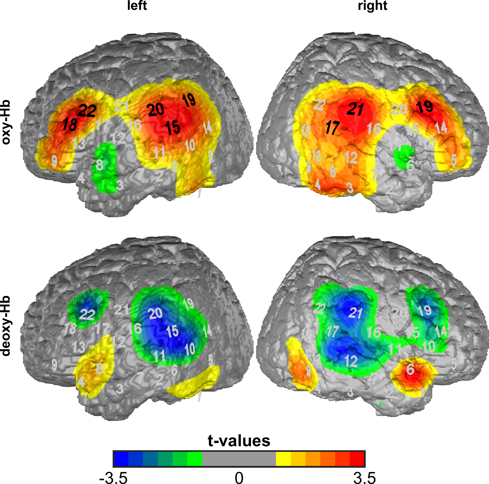 | 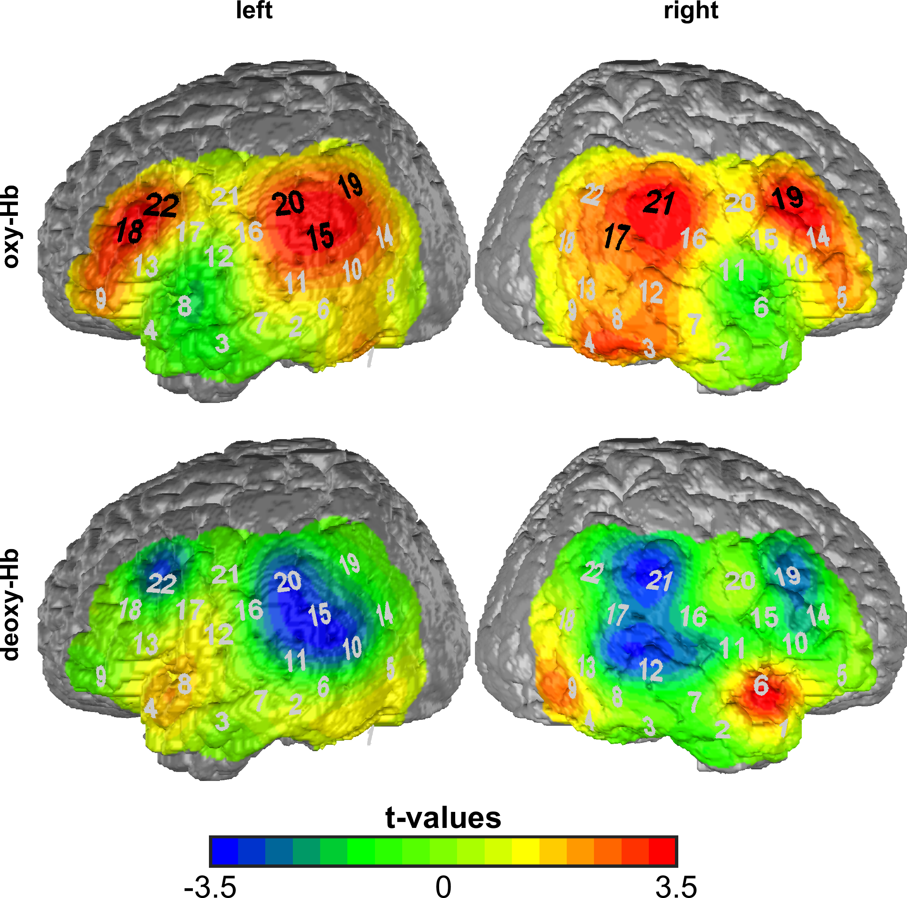 |

Here are some examples of other color maps:

| `color_map` | | |
|-------|--------|---------|
| `'jet'` | `'braincmap'` | `'braincmap2'` |
| 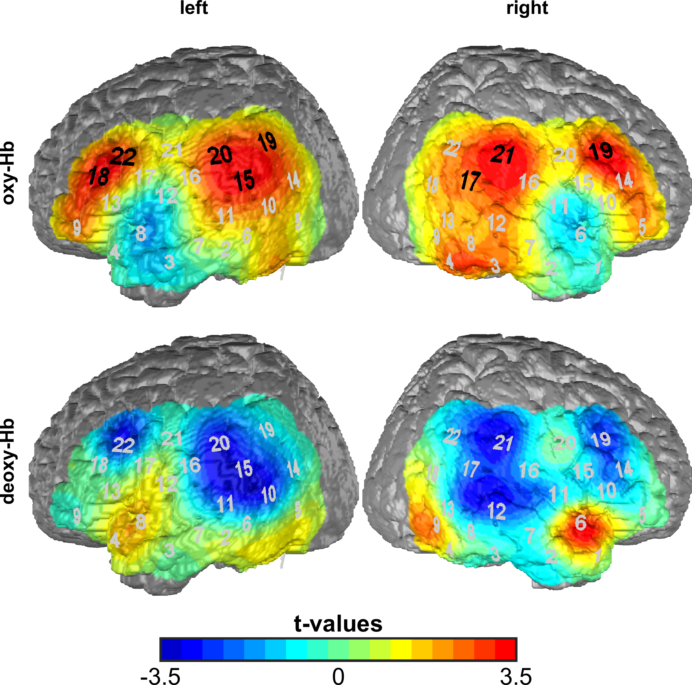 | 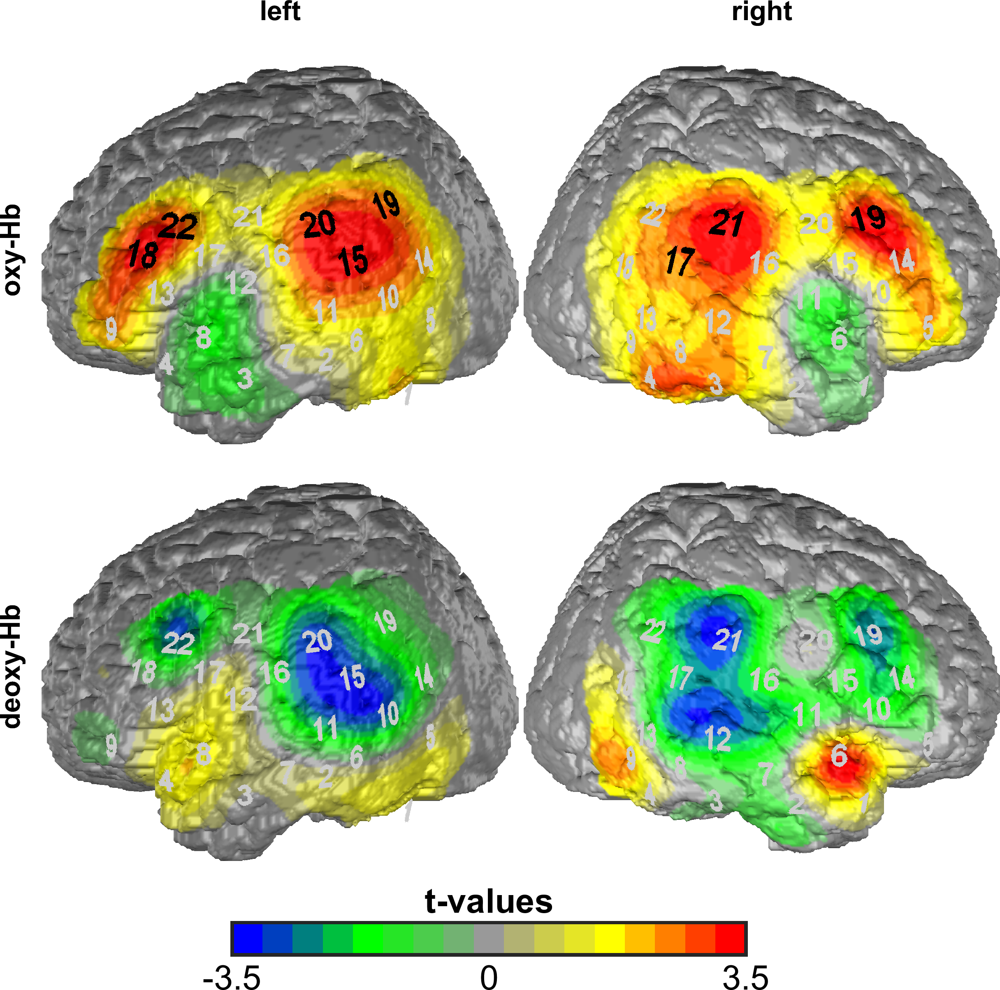 |  |


The color map `colorandgray` works for color prints as well as for grayscale prints:

| color map `colorandgray` | | |
|-------|--------|---------|
| color print | grayscale print |
| 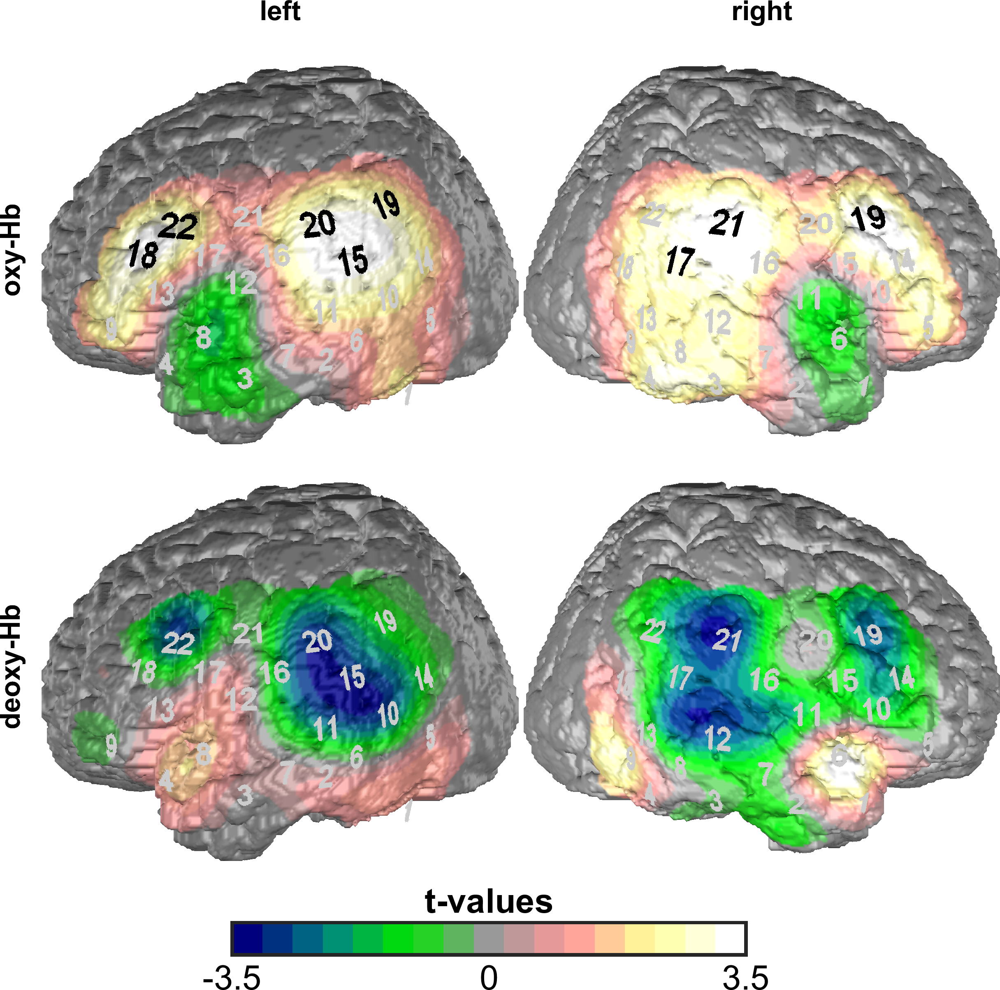 | 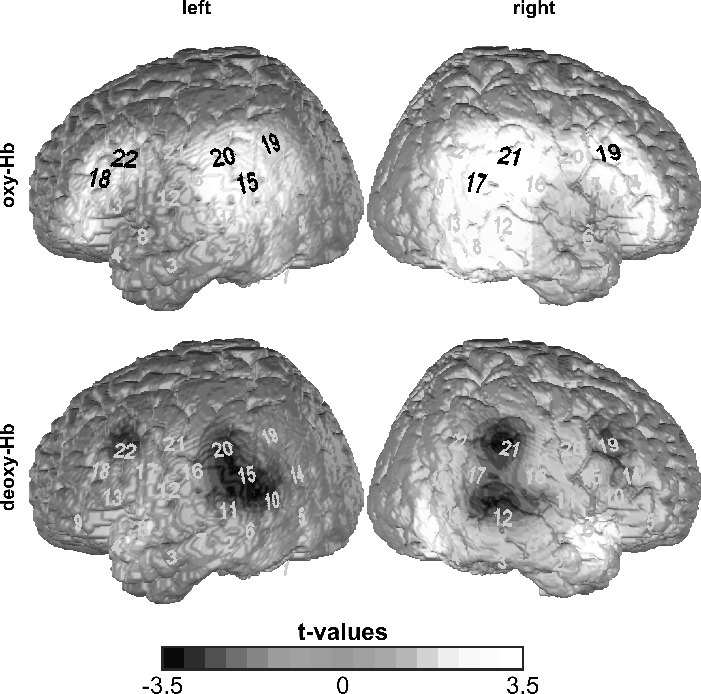 |


## Several probe sets ##

It is also possible to map several probe sets on one brain. Therefore, the test names must be rearanged as follows:
``` matlab
P = P.setProperty('tests2map',{ ...
    ;{'oxy.p1.block_nonbiter','oxy.p2.block_nonbiter'} ...
    ,{'deoxy.p1.block_nonbiter','deoxy.p2.block_nonbiter'} ...
}); % now a 1x2 cell-array, instead of 2x2
% two possibilities for the 'probesets2map'-property:
% 1.
% P = P.setProperty('probesets2map', {...
%   {'left','right'},{'left','right'}
% });
% 2. shorter, the given cell will be extended to fit the dimension of the given 'tests2map'-cell
P = P.setProperty('probesets2map',{'left','right'});

% same with the 'view_angles'-property:
P = P.setProperty('view_angles',[180 0]); % will be used for all brains

P = P.setProperty('color_map','braincmap');
P = P.setProperty('row_names',{''});
P = P.setProperty('column_names',{'oxy-Hb','deoxy-Hb'});

P.map('statistics',T);
```

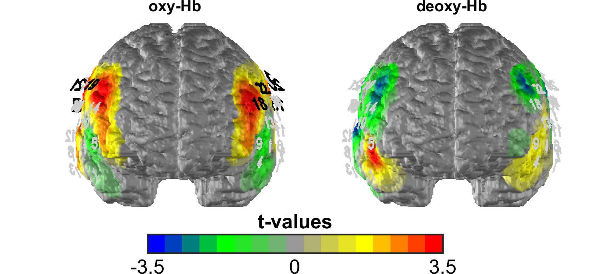


## View angles ##

The following figure gives different examples for the 'view_angles'-property. The view angels are given as a 2-element vector `[phi theta]`:

{{:usersection:psychphys:manual:mapexample_views.png?400|}}


## Map types ##

Following table shows the different map-types:

| `map_type` | | |
|-------|--------|---------|
| `'brain_map'` | `'brain_blobs'` | `'head_map'` |
| 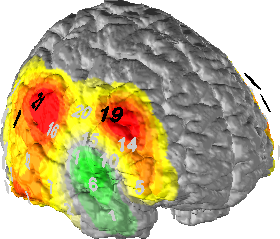 | 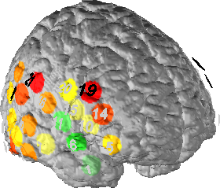 | 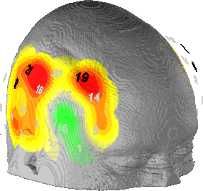 |
|  Voxel-wise interpolation using Radial Basis Function (RBF)  |  No interpolation  |  Interpolated map on the head surface. Useful to show extra-cranial effects.  |


## Further map-options ##

| `show_probeset` | `on` | `off` |
|-------|--------|---------|
| |  | 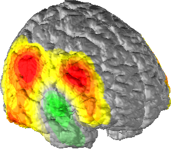 |

| `show_head` | `on` | `off` |
|-------|--------|---------|
| | 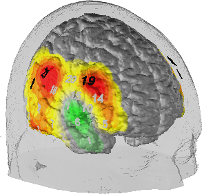 |  |
